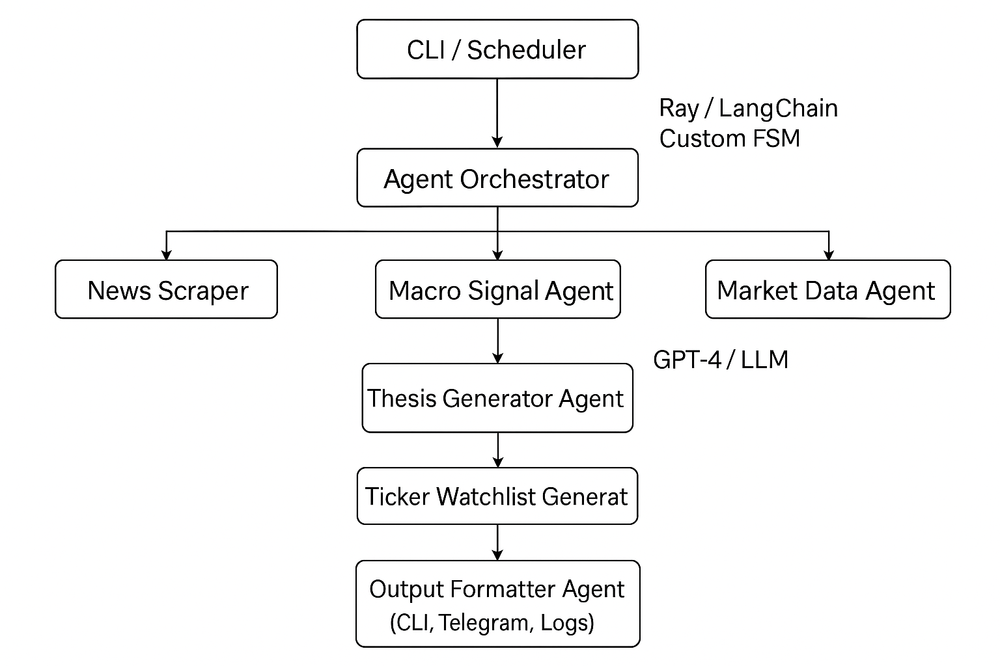

# 📈 Multi-Agent System: Intraday Trading Intelligence Engine

## 🚀 Overview

This multi-agent system autonomously analyzes financial data from online sources, market feeds, and macroeconomic signals to generate a **daily thesis and tradeable ticker recommendations** for intraday trading. The system is modular, scalable, and GPU-enhanced to process high-volume data efficiently.

---

## 🧠 System Architecture

---

## 🧩 Agent Roles

| Agent                 | Purpose                                                                 |
|----------------------|-------------------------------------------------------------------------|
| **News Scraper**      | Scrapes real-time financial headlines from Yahoo Finance, CNBC, Reddit |
| **Macro Signal Agent**| Pulls rates, inflation, oil, bond yields, and interprets market impact |
| **Sentiment Agent**   | Uses LLM or local transformer (FinBERT, DistilBERT) to score news tone |
| **Market Data Agent** | Fetches real-time technical data (VWAP, RSI, volume, etc.)              |
| **Thesis Agent**      | Synthesizes all inputs to generate a coherent market narrative          |
| **Ticker Agent**      | Suggests long/short/neutral tickers with justification                  |
| **Output Agent**      | Outputs results to CLI, logs, or messaging platform                     |

---

## ⚙️ Tech Stack

| Component        | Stack                                  |
|------------------|----------------------------------------|
| Orchestration     | Python + custom CLI / LangChain / Ray |
| LLM Inference     | OpenAI GPT-4 API or HuggingFace models|
| Market Data       | yfinance, Alpaca, Polygon.io           |
| Sentiment Engine  | FinBERT, DistilBERT (GPU-accelerated) |
| Storage           | `.env`, local JSON logs, Redis (opt.) |
| Deployment        | CLI, Docker (optional), cron scheduler|

---

## 💡 Daily Workflow

1. **8:00 AM ET**: System wakes up, runs scrapers + sentiment + macro.
2. **8:15 AM**: Thesis is generated and validated with technicals.
3. **8:30 AM**: Watchlist with conviction scores is printed to CLI/log/sent.
4. **9:30 AM–10:00 AM**: User executes trade plan based on suggestions.

---

## 📌 Example Output

📝 Thesis: Tech stocks under pressure after new China chip rules. Oil spike suggests energy long. Bond yields rising = pressure on growth.

📈 Watchlist:

NVDA (Short) – China exposure, bearish tone

XLE (Long) – Energy sector rising with oil

TLT (Short) – Bond yields up, bonds down

---

## 📦 Future Upgrades

- Backtesting engine for thesis performance
- Reinforcement learning feedback loop
- Real-time L2 data integration
- Telegram/Slack auto alerts
